# 11 Ways for Data Vis

# D3.js

D3.js is a popular data visualization library for JavaScript. Since we have already finished an assignment based on D3.js, it is relatively easy to create a visualization. On the other hand, D3.js provide a function to read cvs file directly, and it helps data import job without any manipulation. There are “NA” values in the raw data, which cannot be dealt with by D3 automatically, unlike some other tools. So I have to deal it with a small function. In this visualization, I create all the points as circles on the svg and bind them with raw data using enter().append(“circle”).data(data) function, then add to scaled axis to proper position. The output of D3 is a HTML file.

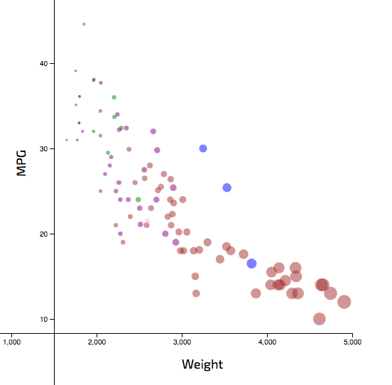

# GoogleCharts

GoogleCharts is an effective API provide by Google, and it is based on JavaScript as well. It provides various chart format and options for JavaScript developers so you can specify a few parameters about axis and chart then it can draw a nice graph for you. However, the way it read a cvs file as data import is not very convinient, so I decide to copy raw data into the script with minor change to fit the format required by this API. I specified options as well to tell API how to setup axis then I call google.visualization.BubbleChart() function to create a chart, finally draw it on the webpage using draw() function. The output of GoogleCharts is a HTML file.

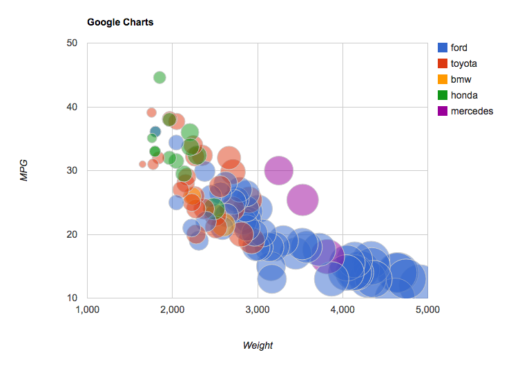

# Python + bokeh 

Python is a mainstream language in data science area, and bokeh is a library based on Python to visualize data. Bokeh also provide a series of template for various type of charts. In this case, I used scatter chart template. The documentation of this library is not very detailed, so it takes me long time to figure out configuration of some parameters. And I have to create a separate function to map name of manufacturers to value of colors. To read data file, I imported pandas library to create a data frame so that bokeh can read some columns as list in the code. First, bokeh.plotting.figure() is invoked to create a chart, then scatter() specify the type and parameters of chart, at last, attributes of x and y axis is set.  The output of bokeh is a HTML file.

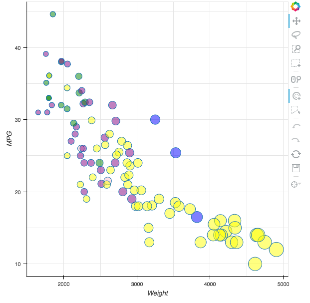

# Python + matplotlib 

Matplotlib is another library for Python data visualization, but it can print the chart directly without specifying output file. The structure of Python code using matplotlib is similar to bokeh. First read cvs file using pandas.read_csv(), then create a figure, last configure parameters of scatter plot and axises. 

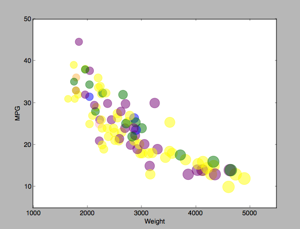

# Python + ggplot 

Ggplot is a data visualization library based on Python and the way to use it is close to ggplot2 given by the example. Huge advantages of this library is that first it work with pandas smoothly, second it can create a chart using a couple of lines of code. But it requires pandas and tkinter to before it can draw a graph. Also, I find it not so easy to find what you want in ggplot documentations, some time you have to try several times. In this chart, I read csv then create chart using ggplot() and print it. The original size of circles are too large so I have create a new column to reduce the size of circles on scale. 

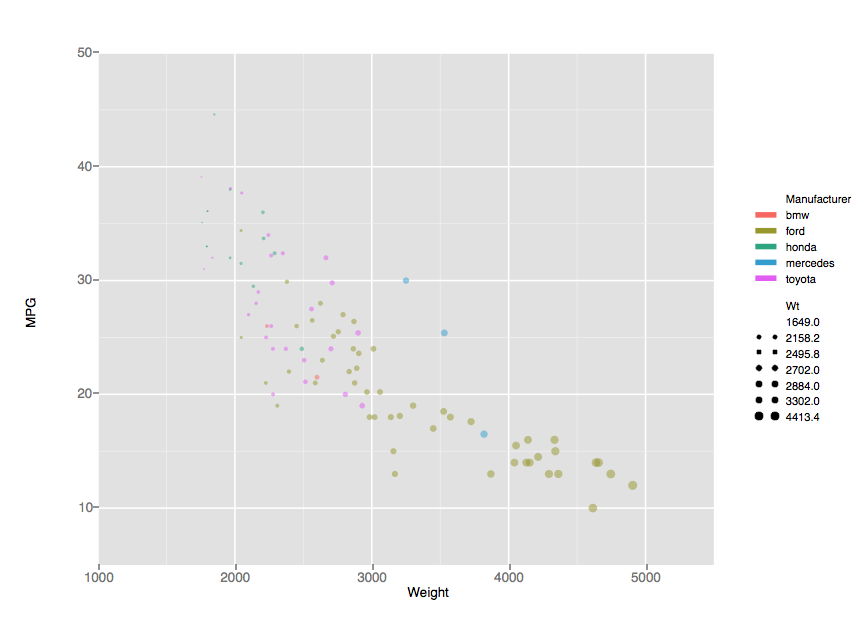

# R + ggplot2

R language and ggplot2 are very popular combination for statistical analysis. Data file like csv can be loaded directly without help of other libraries. And also this combination allow you to export output file in different format. The code to draw a graph is very short. Basically you just read csv file then creat a graph using ggplot() function. I choose to generate pdf file as output.

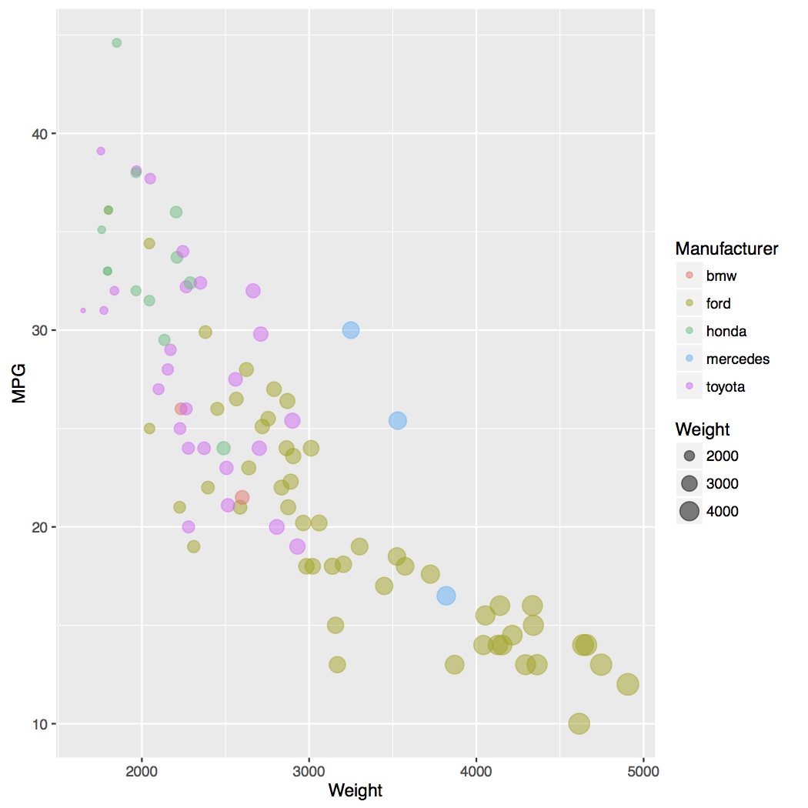

# Tableau

Tableau is a famous data visualization tool and it is very convenient. You can read raw data of various format then create charts in a very short time. Basically you will just drag name of column into where you expect it shows, then you adjust parameters. The output of Tableau is a twb file. 

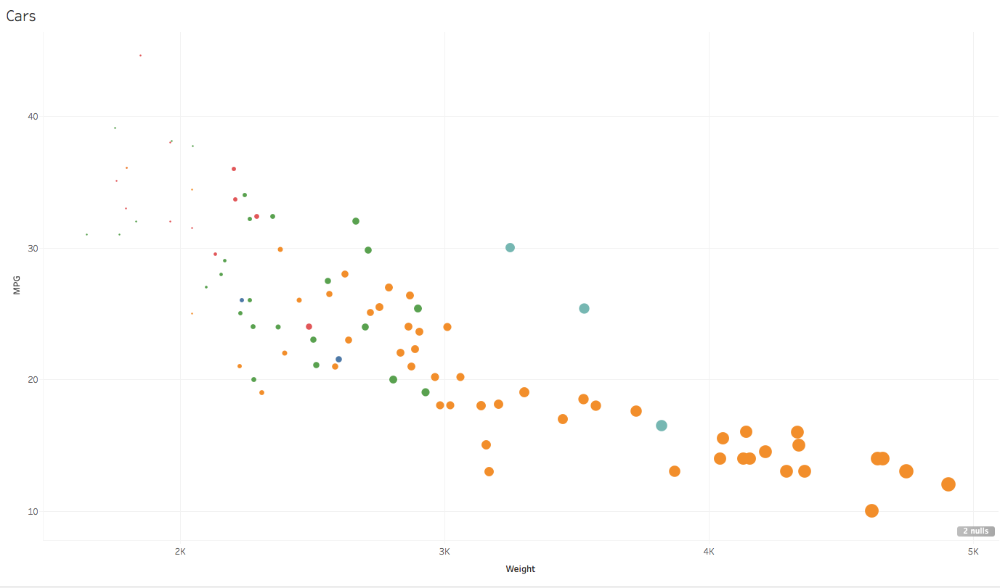

# Excel

Excel is a component in Office suite. It can draw a bunch of different charts. The big problem for me is that the version of excel on my laptop is too old that I have to use a template downloaded online to finish the job. And also it takes time for me to learn how to specify the relationship between column/data to graph parameters. The output of Excel is a xls file.

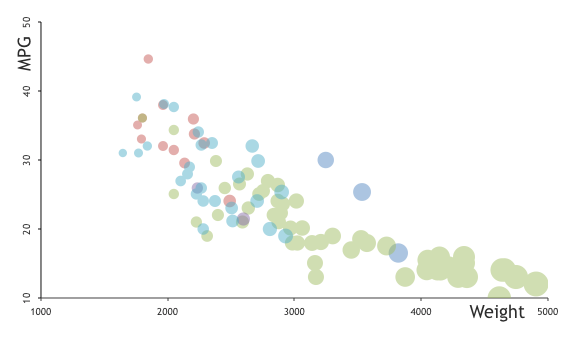

# Keynote

Keynote is a component of iWork suite. It is similar to PowerPoint in Office, but it can draw beautiful charts. To meet the requirement of data, I have to change the format of table. The other problem is that the default scaled size of circle is too large in my opinion, to make the chart pretty, I added a invisible circle to balance the scale. The output of Keynote is a key file.

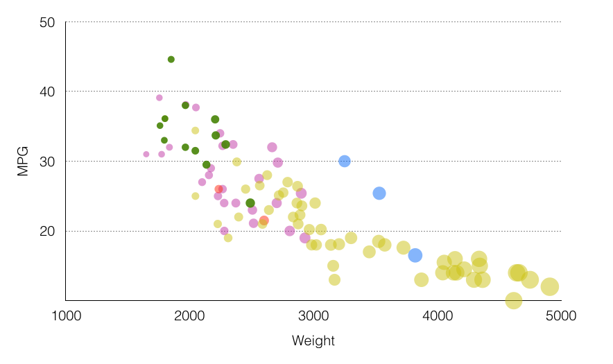

# LibreOffice

LibreOffice is an office suite for Linux, and it can fulfill the same function as Excel. Basically, the way to make chart is quite similar to above two ways. And it also has scaled size issue, and I fixed it in the same way as Keynote. 

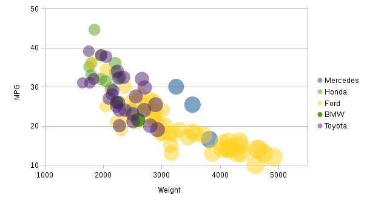

# RAW

RAW is a online data visualization tool. The url of RAW is http://app.raw.densitydesign.org/. It allow users to create chart by selecting parameters in a simple GUI. Besides easiness of creating a chart, it take different data format as input and it can output file in different file format. I provide both png file and svg file as output.

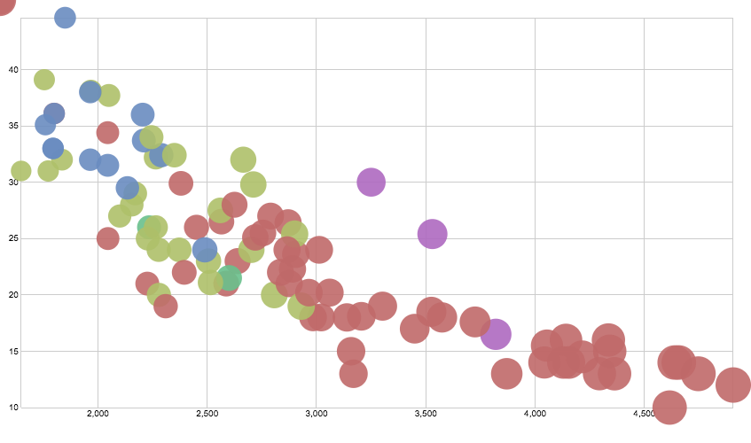